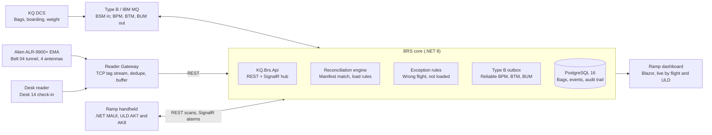

# Kenya Airways Baggage Tracking POC — C# Technical Specification

Oct 2, 2026 · @Shane Crompton

## 1. Overview

This spec defines a .NET 8 (C#) Baggage Reconciliation System (BRS) that tracks 700 RFID-tagged bags on Kenya Airways flight KQ-504 (NBO to EBB) through three scan points, and blocks any bag from being loaded unless it is matched to that flight. It turns the Holomatrix discussion draft ([source](https://assets.ocmo.co.za/kenya-airways-baggage-tracking-poc.html), September 2026) into something developers can build from.

**Goal:** "Every bag. Accounted for at every hand-off." No bag leaves on the wrong flight, and every bag has a digital chain of custody covering the four IATA Resolution 753 tracking points.

| Parameter | Value |
| --- | --- |
| Airport | Jomo Kenyatta International (JKIA), Terminal 1A |
| Flight | KQ-504, NBO to EBB (Entebbe), single intra-Africa route |
| Volume | 350 passengers, 700 bags (2 per passenger) |
| Scan points | 3: check-in desk (Desk 14), conveyor tunnel (Belt 04), ramp handheld (ULD AK7/AK8, Hold 2) |
| Tags | UHF RFID (EPC Gen2), 10-digit IATA licence plate; single-use for economy, reusable for Business/SkyPriority |
| Fixed reader | Alien ALR-9900+ EMA (conveyor tunnel; optionally the check-in desk) |
| Messaging | IATA Type B / MQ, RP 1745 messages: BSM, BPM, BTM, BUM |
| Target read rate | > 99% |

**In scope:** reading tags at the 3 scan points, taking in BSMs from the DCS, matching bags to the flight manifest in real time, authorising ramp loading, handling exceptions (wrong-flight alerts), a live ramp dashboard, an audit trail, and evaluation reports.

**Out of scope for the POC:** more than one flight, controlling the sorter, connecting to the airport's baggage handling system (BHS) PLCs, charging tags to passengers, and replacing the production DCS or BRS.

## 2. Solution architecture

Three kinds of input feed one BRS core on-premises at JKIA: tag reads from the Alien reader through a Reader Gateway, BSMs from the KQ DCS over Type B/MQ, and ramp scans from the handheld. The core decides match or load, and pushes the result to the dashboard and the handheld.



A bag's data flows like this: a BSM creates the expected bag. Desk and tunnel reads move it through `CheckedIn` and `Sorted`, and each sends a BPM out through the outbox. The handheld's load request is approved or refused by the reconciliation engine, and a refusal sets off the alarm over SignalR.

## 3. RFID hardware integration (Alien ALR-9900+ EMA)

The tunnel reader runs in Alien autonomous mode and pushes tag reads over TCP to a .NET 8 Reader Gateway service. This is preferred to polling with the vendor SDK. Alien's [.NET SDK v2.3.2](https://www.alientechnology.com/products/files-2/alr-9900/) (2013, `AlienRFID2.dll`, .NET Framework) is used only for reader setup and diagnostics tools, because it predates .NET 8.

### 3.1 Placement

| Scan point | Device | Antennas | IATA message |
| --- | --- | --- | --- |
| Check-in desk (Desk 14) | Desktop UHF reader, or a 2nd ALR-9900+ with 1 near-field antenna | 1 | BSM (from the DCS; RFID confirms the tag is bound to the bag) |
| Conveyor tunnel (Belt 04) | Alien ALR-9900+ EMA | 4, circularly polarised, around the belt | BPM (sorter) |
| Ramp / hold (ULD AK7, AK8, Hold 2) | Rugged Android UHF handheld | built in | BPM (loaded) and BTM (transfer) |
| Destination (EBB carousel) | Handheld or fixed reader | 1–2 | BUM / arrival |

### 3.2 Reader interface

The reader is controlled through the text-based Alien Reader Protocol over TCP (the Telnet command port, 23 by default). Each command ends in a newline. Prefixing a command with `\x01` turns off the interactive prompt, so responses can be parsed by code. Startup configuration the gateway sends (check exact names and values against the Alien Reader Interface Guide 8101938-000):

```
set TagListFormat = XML
set AntennaSequence = 0 1 2 3
set AcqG2Session = 1
set PersistTime = 2
set TagStreamMode = On
set TagStreamAddress = <gateway-ip>:4000
set TagStreamFormat = XML
set AutoMode = On
```

- **Tag stream (preferred):** the reader pushes each read as it happens to a `TcpListener` in the gateway. Each read carries the EPC, antenna, read count, first and last seen time, and RSSI.
- **Notify mode (fallback):** the reader sends a batched tag list when its notify trigger fires (`NotifyMode`, `NotifyAddress`, `NotifyTrigger`).
- **Heartbeat:** the gateway sends `get ReaderName` every 10 s. If it fails, the gateway reconnects with exponential backoff (1 s up to 30 s) and raises a `ReaderOffline` alert.
- **Credentials** come from the secret store. The factory default login must be changed before go-live.

### 3.3 C# integration classes

```csharp
public interface IRfidReader : IAsyncDisposable
{
    string ReaderId { get; }
    Task ConnectAsync(CancellationToken ct);
    Task ConfigureAsync(ReaderProfile profile, CancellationToken ct);
    Task<string> SendCommandAsync(string command, CancellationToken ct);
    IAsyncEnumerable<TagRead> ReadsAsync(CancellationToken ct);
}

public sealed record TagRead(
    string ReaderId, string Epc, int Antenna, int? Rssi,
    int ReadCount, DateTimeOffset FirstSeenUtc, DateTimeOffset LastSeenUtc);

public sealed class AlienAlr9900Reader : IRfidReader { /* TcpClient command channel + TcpListener tag stream */ }
public sealed class AlienTagStreamParser { /* XML <Alien-RFID-Tag> to TagRead */ }
public sealed class SimulatedReader : IRfidReader { /* replays CSV of reads for tests */ }
```

### 3.4 Read filtering and EPC decoding

1. **De-duplicate:** a bag passing the tunnel produces many raw reads. Collapse them into one `BagScan` per EPC per scan point within a 3-second window (configurable). Keep the antenna that saw it most and the strongest RSSI.
2. **Decode the EPC** to the 10-digit IATA licence plate (LPN) following IATA RP 1740c. `ILicencePlateCodec` hides the exact encoding until the tag supplier confirms it.
3. **Ignore** EPCs that are not bag tags (wrong header or filter value), but count them so stray tags can be diagnosed.
4. **Calibrate during Phase 02:** RF attenuation per antenna, belt speed, and stopping reads from the next lane (cross-read).

## 4. C# application design

The system is one .NET 8 solution, `KQ.Brs.sln`, built as a modular monolith (one API host) plus separate edge services: one gateway per reader, and a handheld app. That is enough for one flight and splits cleanly later.

### 4.1 Projects

| Project | Type | Responsibility |
| --- | --- | --- |
| `KQ.Brs.Domain` | Class library | Entities, value objects (`LicencePlate`, `FlightKey`), reconciliation rules, domain events |
| `KQ.Brs.Application` | Class library | Use cases (`RecordScan`, `AuthoriseLoad`, `ResolveException`), interfaces, MediatR handlers |
| `KQ.Brs.Infrastructure` | Class library | EF Core 8 + PostgreSQL, outbox, Serilog sinks, secret store |
| `KQ.Brs.Messaging` | Class library | IATA Type B parser and builder (BSM, BPM, BTM, BUM per RP 1745), IBM MQ adapter (`IBMMQDotnetClient`) |
| `KQ.Brs.Api` | ASP.NET Core 8 | REST API, SignalR hub `/hubs/ramp`, auth, health checks |
| `KQ.Brs.ReaderGateway` | Worker Service (Windows service or Linux systemd) | Drives the Alien ALR-9900+ (section 3), filters reads, posts `BagScan` to the API with a local buffer while offline |
| `KQ.Brs.Dashboard` | Blazor Web App | Ramp reconciliation view, exceptions, reports |
| `KQ.Brs.Handheld` | .NET MAUI (Android) | Ramp scanning, container assignment, audio alarm and screen lock |
| `KQ.Brs.Simulator` | Console | Generates 700-bag BSM sets and replays reads for load tests |
| `KQ.Brs.Tests.*` | xUnit | Unit, integration (Testcontainers), contract tests for Type B |

### 4.2 Core services

```csharp
public interface IReconciliationService
{
    Task<ScanOutcome> RecordScanAsync(BagScan scan, CancellationToken ct);
    Task<LoadDecision> AuthoriseLoadAsync(LicencePlate lp, string uldId, FlightKey flight, CancellationToken ct);
    Task<FlightReconciliation> GetFlightStatusAsync(FlightKey flight, CancellationToken ct);
}

public interface ITypeBMessageParser { BaggageMessage Parse(string raw); }   // BSM/BPM/BTM/BUM
public interface ITypeBMessageBuilder { string Build(BaggageMessage msg); }
public interface IMessageBus { Task PublishAsync(BaggageMessage msg, CancellationToken ct); IAsyncEnumerable<string> ConsumeAsync(string queue, CancellationToken ct); }
public interface ILicencePlateCodec { bool TryDecode(string epcHex, out LicencePlate lp); string Encode(LicencePlate lp); }
public interface IExceptionRuleEngine { IEnumerable<BagException> Evaluate(Bag bag, BagScan scan, FlightManifest manifest); }

public enum ScanOutcome { Matched, Unknown, WrongFlight, Offloaded, Duplicate, NotAuthorised }
public sealed record LoadDecision(bool Authorised, string Reason, BagException? Exception);
```

### 4.3 Tech stack

- .NET 8 LTS, C# 12, nullable reference types on, warnings treated as errors
- ASP.NET Core minimal APIs, SignalR, Blazor; .NET MAUI for Android
- EF Core 8 + Npgsql (PostgreSQL 16); SQL Server also supported if KQ requires it
- MediatR, FluentValidation, Polly (retries and circuit breaker on MQ and reader links)
- Serilog to Seq or ELK; OpenTelemetry traces and metrics
- xUnit, FluentAssertions, Testcontainers, NSubstitute
- Deployed with Docker on an on-premises JKIA server; the gateways run on industrial PCs next to the readers

## 5. Data model

The bag, keyed by its 10-digit licence plate, is at the centre of the model. Every scan is added as an event that is never changed or deleted (an append-only audit log), and the bag's current status is derived from those events.

| Entity | Key fields | Notes |
| --- | --- | --- |
| `Flight` | `Id`, `Carrier` (KQ), `Number` (504), `Date`, `Origin` (NBO), `Destination` (EBB), `Std`, `Status` | `FlightKey` = carrier + number + date |
| `Passenger` | `Id`, `PnrLocator`, `Surname`, `Initial`, `TicketStatus`, `BoardingStatus`, `Class` | From DCS; personal data kept to a minimum |
| `Bag` | `LicencePlate` (char 10), `Epc`, `PassengerId`, `FlightId`, `Routing` (NBO-EBB), `WeightKg`, `TagType` (Disposable / Reusable), `Status`, `Authorised` | Created from BSM |
| `ScanPoint` | `Id` (DESK14, BELT04, RAMP-AK7), `Kind` (Desk / Tunnel / Ramp / Transfer / Arrival), `ReaderId`, `MessageType` | Configured once |
| `BagEvent` | `Id` (ULID), `LicencePlate`, `ScanPointId`, `MessageType` (BSM/BPM/BTM/BUM), `OccurredUtc`, `ReaderId`, `Antenna`, `Rssi`, `MatchStatus`, `LoadAuthorised`, `HandlerId`, `RawMessage` | Append-only audit trail |
| `Uld` | `Id` (AK7, AK8), `FlightId`, `Hold` (2), `Position` | Container or cart |
| `BagException` | `Id`, `LicencePlate`, `Type` (WrongFlight, Unknown, MissingAtSorter, NotLoaded, PaxNotBoarded), `RaisedUtc`, `Severity`, `State` (Open / Acknowledged / Resolved), `ResolvedBy`, `ResolutionNote` | Drives alerts |
| `OutboxMessage` | `Id`, `Type`, `Payload`, `CreatedUtc`, `SentUtc` | Reliable Type B / MQ sending |

**Bag status flow:** `Expected` (BSM received) → `CheckedIn` (desk RFID confirmed) → `Sorted` (tunnel BPM) → `Loaded` (ramp scan, authorised) → `Transferred` (BTM, if any) → `Arrived` (BUM/arrival). Other statuses: `Offloaded` (BSM with the delete flag, or the passenger did not board) and `Exception`.

**Indexes:** `Bag(LicencePlate)` unique, `Bag(Epc)` unique, `BagEvent(LicencePlate, OccurredUtc)`, `BagException(State, FlightId)`.

**Retention:** passenger names and PNRs are deleted 30 days after the flight unless KQ data governance sets a different period (open question). Event data with personal details removed is kept for evaluation.

## 6. APIs and integrations

BSMs come in from the KQ DCS over IATA Type B on MQ. Scans come in over REST from the gateways and the handheld. Status messages (BPM, BTM, BUM) go out through an outbox, so a message is never lost if MQ is down.

### 6.1 IATA Type B messages (RP 1745)

| Message | Direction | Trigger | Key elements |
| --- | --- | --- | --- |
| BSM (Baggage Source Message) | In, from DCS | Bag checked in at Desk 14 | `.V/` (status), `.F/` (outbound flight), `.N/` (licence plate), `.P/` (passenger), `.W/` (weight), `.S/` (authority to load / boarding) |
| BPM (Baggage Processed Message) | Out | Tunnel read on Belt 04; ramp load into a ULD | `.V/`, `.J/` (processing info: scan point, time), `.F/`, `.N/`, `.U/` (ULD AK7) |
| BTM (Baggage Transfer Message) | In and out | Hand-over between carriers or flights | `.I/` (inbound flight), `.F/`, `.N/` |
| BUM (Baggage Unload Message) | Out | Off-load or arrival at the EBB carousel | `.V/`, `.F/`, `.N/` |

The parser handles the `CHG` (change) and `DEL` (delete) variants of a BSM, and BSMs listing several licence plates (`.N/` with a count). Every raw message is stored with the `BagEvent` it produced.

### 6.2 REST API (`KQ.Brs.Api`, JSON, OAuth2 / JWT)

| Method | Route | Used by | Purpose |
| --- | --- | --- | --- |
| POST | `/api/v1/scans` | Reader Gateway, Handheld | Record a `BagScan`; returns the `ScanOutcome` |
| POST | `/api/v1/scans/batch` | Reader Gateway | Send buffered scans after a network outage |
| POST | `/api/v1/loads/authorise` | Handheld | Request a load decision for a licence plate + ULD; returns `LoadDecision` |
| GET | `/api/v1/flights/{key}/reconciliation` | Dashboard | Totals and per-bag status |
| GET | `/api/v1/bags/{licencePlate}` | Dashboard, Handheld | Bag details and its event history |
| GET | `/api/v1/exceptions?flight=&state=` | Dashboard | List exceptions |
| POST | `/api/v1/exceptions/{id}/resolve` | Handheld, Dashboard | Record the corrective action and rescan |
| POST | `/api/v1/messages/typeb` | Test / DCS fallback | Accept a raw Type B message over HTTP |
| GET | `/health/live`, `/health/ready` | Ops | Liveness and readiness checks |

### 6.3 Real-time (SignalR hub `/hubs/ramp`)

- `ScanRecorded(FlightKey, BagStatusDto)` updates the dashboard rows
- `ExceptionRaised(BagExceptionDto)` makes the handheld sound its alarm and lock the screen, and highlights the row on the dashboard
- `ReconciliationChanged(FlightTotalsDto)` updates the totals tiles
- `ReaderStatusChanged(ReaderId, Online)` reports reader health

### 6.4 External dependencies

- **KQ DCS:** bag records, boarding sequence, ticket status, bag weight (BSM + passenger boarding updates)
- **IBM MQ / Type B gateway** (SITA or ARINC, to be confirmed): queue names, channel and TLS certificates still to be provided
- **Airport network:** a VLAN from the readers to the gateways to the API; port 23 and the tag-stream port open only inside it

## 7. Functional requirements

The most important requirement is FR-05: no bag is loaded into the hold without a positive match to KQ-504 and confirmation that its passenger is eligible to fly.

| ID | Requirement |
| --- | --- |
| FR-01 | Take in BSMs (including CHG and DEL) and create or update `Bag` records within 2 s of receipt |
| FR-02 | At Desk 14, read the RFID tag, decode the licence plate, and confirm it matches the bag record (a desk check that the tag is bound to the right bag) |
| FR-03 | At the Belt 04 tunnel, record one de-duplicated scan per bag, send a BPM, and check the bag against the KQ-504 manifest |
| FR-04 | On the ramp, the handheld scans the bag and the ULD (AK7/AK8) and asks for a load decision |
| FR-05 | Authorise loading only if: the bag is on the KQ-504 manifest, is not offloaded, its passenger's ticket is valid, and its passenger has checked in or boarded (rule set configurable) |
| FR-06 | Unauthorised bag at the ramp: the handheld sounds an alarm and locks the screen, showing the flight and container it actually belongs to |
| FR-07 | Bag tagged for another flight (e.g. KQ-412) seen in the KQ-504 lane: raise a `WrongFlight` exception straight away |
| FR-08 | Handler moves the bag and rescans it; the exception is resolved only after a successful rescan; the corrective action is logged |
| FR-09 | Update the manifest and the dashboard in real time (< 1 s after the scan is processed) |
| FR-10 | Before pushback, show any bag that is expected but not loaded, and any bag whose passenger did not board (offload list) |
| FR-11 | Record BTM events at the transfer point and BUM / arrival events at the EBB carousel |
| FR-12 | Every event is kept in an append-only audit history: who did what, when, where and with which device |
| FR-13 | Evaluation reports: read rate per scan point and antenna, missed reads, exceptions and time to resolve, and turnaround impact |

### 7.1 Ramp dashboard (Blazor)

Shows totals and a live list of bags for KQ-504:

- **Totals tiles:** Total expected (700), Check-in verified (BSM), Sorter verified (BPM), Hold loaded and cleared, Open exceptions
- **Lane and containers:** Belt 04 to carts AK7 and AK8
- **Bag list:** licence plate, passenger (initial + surname), status badge (MATCHED, IN SCAN, EXCEPTION, MISSING), last scan point, last seen time
- **Filters:** status, ULD, exception state; click a bag to see its full event timeline

### 7.2 Misroute recovery workflow

1. **Detect:** the tunnel reads a bag tagged for KQ-412 in the KQ-504 makeup lane, and the rule engine raises `WrongFlight`.
2. **Alert:** the alert is pushed over SignalR. The handheld sounds an alarm, locks the screen, and shows the correct flight and container.
3. **Intercept:** the handler moves the bag to the correct lane and rescans it. The handheld unlocks only after a matching rescan or a supervisor override.
4. **Update:** the BRS updates the manifest, closes the exception, and writes the corrective action to the audit history.

Escalation rules, lockout thresholds and recovery procedures are still "to be confirmed" in the source deck. They are held as configuration in `ExceptionPolicyOptions`.

## 8. Non-functional requirements

The POC must hold a read rate above 99% and give ramp crew a decision within 1 second, without adding to turnaround time.

| Area | Requirement |
| --- | --- |
| Read accuracy | > 99% of the 700 bags read at each fixed scan point; missed reads listed on the evaluation report |
| Latency | Tag read to dashboard update ≤ 1 s (p95); load decision on the handheld ≤ 500 ms (p95) |
| Throughput | Tunnel: 1 bag per second at peak; API: 50 scans/s sustained, tested at 200 scans/s |
| Availability | 99.5% across the trial window; gateway buffers ≥ 24 h of scans locally (SQLite) if the network drops |
| Reliability | Scans are idempotent (the key is `ReaderId + Epc + window start`); outbox guarantees each MQ message is delivered at least once |
| Security | TLS 1.2+ on every connection; JWT with roles (Handler, Supervisor, Ops, Admin); reader on an isolated VLAN; secrets in the store, not in config files |
| Privacy | Only the passenger's surname and initial on screen; personal data encrypted at rest; retention follows section 5; KQ data governance agreement in place |
| Audit | Append-only `BagEvent` table; supervisor overrides need a reason; logs kept 90 days |
| Observability | Serilog structured logs; OpenTelemetry metrics (reads per second per antenna, reconnects, queue depth, exception count); health checks |
| Usability | Handheld usable with gloves: large targets, audio and vibration alerts that can be heard on the apron |
| Portability | API and dashboard run in Linux containers; the gateway runs on Windows or Linux |

## 9. Testing, success criteria and plan

The POC succeeds if all 700 bags on the live KQ-504 trial are read above 99% at every fixed scan point, no bag departs towards the wrong destination, and a simulated misroute is caught and fixed on the ramp.

### 9.1 Success criteria

- [ ] Read rate > 99% at Desk 14, Belt 04 and the ramp
- [ ] Zero bags departing towards the wrong destination
- [ ] Ramp crew alerted instantly (≤ 1 s) on every unauthorised scan
- [ ] Manifest reconciled in real time, with a clear before-pushback status
- [ ] Turnaround not extended by the handheld workflow (compared with a baseline flight)

### 9.2 Test strategy

| Level | What | Tooling |
| --- | --- | --- |
| Unit | Rules, EPC to licence plate decoding, Type B parse/build, read de-duplication | xUnit, FluentAssertions |
| Contract | Sample BSM/BPM/BTM/BUM messages from KQ and the Type B provider | Golden files |
| Integration | API + PostgreSQL + MQ | Testcontainers |
| Hardware bench | ALR-9900+ with 4 antennas, 50 sample tags, belt speed simulated | Gateway + reader on a bench |
| Load | 700-bag BSM set, 200 scans/s replayed | `KQ.Brs.Simulator`, k6 |
| Site acceptance | Belt 04 walk tests, check for cross-reads from neighbouring lanes, ramp RF survey | Phase 02 calibration |
| Live trial | KQ-504 normal run + simulated KQ-412 misroute | Phase 03 |

### 9.3 Phases (from the source deck; dates still to be agreed)

1. **Design and survey:** survey the Terminal 1A belt paths, confirm KQ-504 as the test flight, confirm the tag specification, set up the DCS feed. Build: domain, Type B parser, gateway against a simulator.
2. **Configure and test:** install the 3 scan units, configure the BRS rules, calibrate the antennas, train the ramp team. Build: dashboard, handheld, bench and load tests.
3. **Live trial flight:** track 700 bags on KQ-504 at normal throughput and simulate misroute recovery.
4. **Evaluation:** read accuracy, turnaround gains, exception logs, and the business case for scaling up.

### 9.4 Open questions

- [ ] Exact EPC encoding of the 10-digit licence plate (IATA RP 1740c) and the tag supplier and chip model
- [ ] DCS vendor, BSM feed transport (Type B over SITA/ARINC, or direct MQ), queue names, test environment
- [ ] Desk scan point: a 2nd ALR-9900+ or a cheaper desktop reader?
- [ ] Handheld make and model, and whether it needs offline load decisions
- [ ] Escalation rules, lockout thresholds and recovery procedures (marked "to be confirmed" in the deck)
- [ ] Who installs and reads at the EBB destination (outside JKIA)?
- [ ] Data retention period and data governance agreement with KQ
- [ ] Hosting: on-premises at JKIA or KQ's cloud tenant?
- [ ] The deck names BUM "Bag Usage Message"; IATA RP 1745 calls it the Baggage Unload Message. Confirm which message KQ means for arrival

## Sources

- [Kenya Airways JKIA Baggage Tracking PoC (Holomatrix discussion draft, Sept 2026)](https://assets.ocmo.co.za/kenya-airways-baggage-tracking-poc.html)
- [Alien ALR-9900+ downloads: .NET SDK v2.3.2, Reader Interface Guide 8101938-000](https://www.alientechnology.com/products/files-2/alr-9900/)
- [Alien ALR-9900+ EMA datasheet](http://www.alientechnology.com/wp-content/uploads/Alien-Technology-ALR-9900+EMA-Enterprise-RFID-Reader.pdf)
